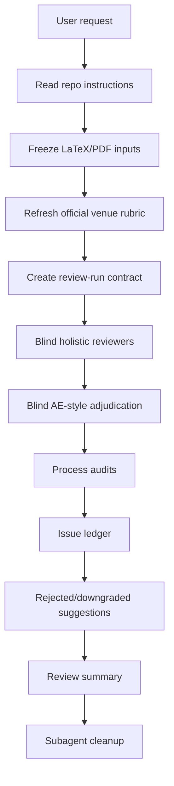

# CS Paper Review Protocol

[中文说明](README.zh-CN.md)

`cs-paper-review-protocol` is a Codex skill for strict, venue-aware pre-submission review of CS, ML, CV, NLP, and related research manuscripts. It is designed for papers submitted to venues such as TMLR, ICLR, NeurIPS, ICML, CVPR, ICCV, ECCV, WACV, ACL, EMNLP, NAACL, and similar venues.

The skill reviews a manuscript. It does not edit the manuscript, run experiments, invent results, or silently turn missing author data into fabricated evidence.

## Recommended Setup

This skill is strongest when Codex can use multiple subagents. For strict review, strongly prefer:

```toml
[agents]
max_threads = 12
```

Lower limits still work, but strict review will run in batches and may take longer.

## Install

If your Codex setup loads skills from `~/.codex/skills`, clone this repository there:

```bash
git clone git@github.com:GentleJinqi/cs-paper-review-skill.git ~/.codex/skills/cs-paper-review-protocol
```

You can also keep it repo-local and invoke it by path if your workflow supports local skill references.

## Quick Start

Typical strict TMLR review:

```text
Use $cs-paper-review-protocol to run a strict TMLR review of my paper. Use the LaTeX source as the content source and the PDF for layout/readability checks.
```

Standard lighter review:

```text
Use $cs-paper-review-protocol to run a standard NeurIPS review of my paper from main.tex and main.pdf.
```

If you do not specify a venue, the default venue profile is TMLR.

## Review Tiers

### Strict

Default mode. It uses 3 or 4 blind holistic reviewer agents plus process agents for coverage, AE-style adjudication, regression or new-risk review when relevant, special-topic review, AI-writing/style review, terminology/math review, layout/PDF review, benchmark/meta calibration, and final meta-adjudication.

Strict mode is intended for serious pre-submission checks when review quality matters more than token cost.

### Standard

Lighter mode. It uses 3 blind holistic reviewers, 1 AE-style adjudicator, and a combined regression/new-risk/meta reviewer when prior ledgers exist. A style or layout reviewer may be added when the PDF or manuscript structure suggests risk.

Standard mode is useful for later review rounds or quick sanity checks after major issues have already been repaired.

## Workflow Map



## What It Produces

By default, a run writes artifacts under:

```text
.paper-review/runs/<date>-<venue>-<tier>-NN/
```

Core artifacts include:

- `frozen-inputs.md`
- `official-rubric.md`
- `review-run-contract.md`
- reviewer reports
- `issue-ledger.md`
- `rejected-suggestions.md`
- `review-summary.md`
- `subagent-cleanup.md`

The exact run folder may change if the target repository has its own `AGENTS.md` or review-artifact policy.

## Boundaries

The skill:

- uses official venue guidance first;
- treats non-official sources only as labeled field-norm calibration;
- prefers LaTeX as the scientific content source and PDF as the layout/readability source;
- treats missing numbers, missing figures, and red revision markup as reviewable gates rather than direct defects;
- may recommend experiments or author data gates;
- does not run experiments, edit the manuscript, fabricate numbers, invent citations, or install itself globally.

## Notes On Venue Awareness

For TMLR, the skill uses TMLR-style reviewer recommendation context such as `accept`, `leaning accept`, `leaning reject`, and `reject`, and AE decision context such as `accept as is`, `accept with minor revisions`, and `reject`.

For other venues, it first refreshes official reviewer, author, submission, ethics, reproducibility, and formatting guidance. It does not invent official score fields when the venue does not publish them.
