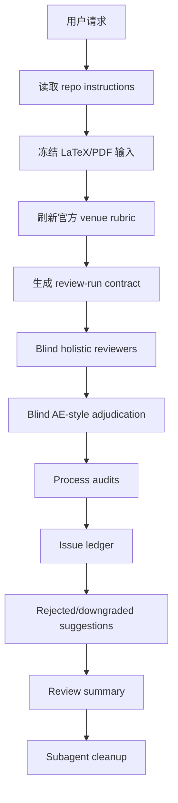

# CS Paper Review Protocol

[English README](README.md)

`cs-paper-review-protocol` 是一个用于 CS、ML、CV、NLP 及相关方向论文投稿前严格审稿的 Codex skill。它适合 TMLR、ICLR、NeurIPS、ICML、CVPR、ICCV、ECCV、WACV、ACL、EMNLP、NAACL 等会议或期刊的预审场景。

这个 skill 的职责是审稿，不是自动改稿。它不会编辑你的 manuscript，不会运行实验，不会编造结果，也不会把作者还没有填写的数据伪装成真实证据。

## 推荐配置

这个 skill 的核心优势是 subagent-driven review。严格审稿时，强烈建议把 Codex 的 subagent 上限设为 12：

```toml
[agents]
max_threads = 12
```

如果你的上限低于 12，也可以运行；strict 档会分批执行，但速度会更慢。

## 安装

如果你的 Codex 会从 `~/.codex/skills` 加载 skills，可以把这个仓库 clone 到那里：

```bash
git clone git@github.com:GentleJinqi/cs-paper-review-skill.git ~/.codex/skills/cs-paper-review-protocol
```

你也可以把它作为 repo-local skill 放在某个项目内，再通过本地路径调用，具体取决于你的 Codex 工作流。

## 快速使用

典型的 TMLR strict review：

```text
Use $cs-paper-review-protocol to run a strict TMLR review of my paper. Use the LaTeX source as the content source and the PDF for layout/readability checks.
```

较轻量的 standard review：

```text
Use $cs-paper-review-protocol to run a standard NeurIPS review of my paper from main.tex and main.pdf.
```

如果你没有指定 venue，默认按 TMLR 处理。

## 审稿档位

### Strict

默认档位。它会使用 3 到 4 个 blind holistic reviewer agents，再加上 coverage、AE-style adjudication、regression/new-risk、special-topic、AI-writing/style、terminology/math、layout/PDF、benchmark/meta calibration 和 final meta-adjudication 等过程型 agents。

Strict 适合正式投稿前的严肃预审，也适合你想尽可能暴露 manuscript 问题的时候。它更费 token，但审查更完整。

### Standard

轻量档位。它通常使用 3 个 blind holistic reviewers、1 个 AE-style adjudicator，以及在已有历史 ledger 时使用 1 个 combined regression/new-risk/meta reviewer。如果 PDF 排版或写作风格有明显风险，也可以加入 style/layout reviewer。

Standard 适合后期复审、快速 sanity check，或者大问题已经修过之后的收尾审查。

## 审稿流程图



## 输出内容

默认情况下，每次 review 会把产物写到：

```text
.paper-review/runs/<date>-<venue>-<tier>-NN/
```

核心文件包括：

- `frozen-inputs.md`
- `official-rubric.md`
- `review-run-contract.md`
- reviewer reports
- `issue-ledger.md`
- `rejected-suggestions.md`
- `review-summary.md`
- `subagent-cleanup.md`

如果目标 repo 的 `AGENTS.md` 或其他项目规则指定了 review artifact 的位置，skill 会优先遵守目标 repo 的规则。

## 边界

这个 skill 会：

- 优先使用目标 venue 的官方审稿人指南、作者指南、投稿说明、伦理要求、复现性要求和格式要求；
- 只把非官方信息作为明确标注的 field-norm calibration；
- 默认以 LaTeX 作为科研内容源，以 PDF 作为版面、阅读体验、figure/table 检查源；
- 将缺失数字、缺失图片、红色 revision markup 视为 reviewable gates，而不是直接扣分项；
- 可以建议实验或标注 author-data gates；
- 不会运行实验、不会编辑 manuscript、不会编造数字、不会虚构引用、不会全局安装自己。

## Venue Awareness

对于 TMLR，它会使用 TMLR 的 reviewer recommendation context，例如 `accept`、`leaning accept`、`leaning reject`、`reject`，以及 AE decision context，例如 `accept as is`、`accept with minor revisions`、`reject`。

对于其他会议或期刊，它会先刷新官方 reviewer guide、author guide、submission instructions、ethics policy、reproducibility checklist 和 formatting instructions。没有官方字段时，它不会自己编造官方打分规则。
