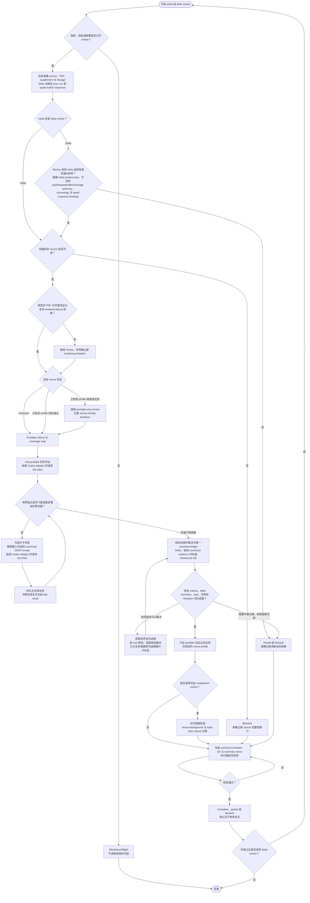

# CS Paper Review

[English README](README.md)

`cs-paper-review` 面向作者侧投稿前检查和增量复审。它先固定被审稿件的
准确版本，再逐项核对科研责任，把证据、未决事项和完成状态写入可校验
记录。审稿过程本身不改稿、不跑实验，也不补造缺失事实。

## 三层能力边界

第一层是 portable scientific core。它规定论文版本、科学覆盖、证据、
finding、裁决和如实完成的共同责任。主要入口是
[scientific core](references/scientific-core.md)、
[coverage contract](references/review-coverage.md) 和
[review workflow](references/review-workflow.md)。

第二层是可选的 venue overlay。用户可以明确 venue、年份和 track；只有
版本化 profile、source manifest 与发布治理的 authority registry 都能
解析且本地字节校验通过时，才会加入该目标的附加标准或原生评价字段。
离线校验能证明记录的目标 tuple、host allowlist 与字节完整性；来源是否
确为官方、是否仍为最新，则属于发布/更新治理责任，不是实时联网证明。
用户也可以保留 `unknown`，此时系统不会替换成某个会议，更不会预测录用
概率。

第三层是可选的
[Codex GPT-5.6 Sol Ultra adapter](adapters/codex-gpt-5.6-sol-ultra.md)。
它只约束一种执行环境，不改变、更不能豁免 scientific core。

前两层之后还可以加载可选的 corpus intelligence。venue-background 与
topic-near 数据集必须分开，决策状态要有证据等级，方向相近性要沿问题、
贡献类型、机制、claim、证据结构、模态/应用六个轴记录。论文数量和相似性
本身既不能预测录用，也不能豁免 core criterion。详见
[venue conditioning](references/venue-conditioning.md)。

## Review 执行管线

这是单篇论文的实际执行流程。外部仓库更新、adapter 候选评估和发布工作属于
维护期，不会进入这条管线。



root 是唯一 canonical writer。是否委派只取决于尚未覆盖的证据风险；任务
数量是运行观察值，不是严谨性指标。定向核验与 delta review 是仅有的科学
反馈 loop；二者都不授权修改论文或运行实验。只有启用可选 Codex adapter
时才应用 Sol Ultra 控制；corpus 校准仅发生在 portable assessment 以及任何
已校验 venue overlay 之后。

## 使用方式

调用 `$cs-paper-review`，并说明稿件 source、与之匹配的 PDF、supplement、
以及材料处理所受的权限和保密约束。增量复审还必须同时提供经校验的 prior
initial run、它的 finding ledger、prior source，以及符合
`schemas/author-response.schema.json` 的 canonical typed author response；
只有 prior ledger 不足以完成 delta review。`complete` delta 还需要匹配的
prior/current PDF，以及在 source 和 rendering 中都可见且彼此不同的
revision evidence。

不指定会议：

```text
Use $cs-paper-review for an author-side pre-submission review. The target
venue is unknown. Freeze main.tex and its matching PDF, produce an
evidence-grounded finding ledger, and do not change the manuscript.
```

指定目标：

```text
Use $cs-paper-review for a CVPR 2027 main-track review. Use the venue overlay
only if the exact release-governed profile validates. Otherwise keep the
scientific assessment neutral and disclose the limitation.
```

增量复审：

```text
Use $cs-paper-review for a delta review against the frozen prior ledger.
Preserve stable finding identities and separate resolution from impact
change.
```

产物位置服从用户要求和目标项目自身的规则；本 skill 不强制一个全局 run
目录。

## 执行成本

外部仓库发现与更新、lifecycle 候选比较、完整 unit suite、发布与 rights
审计都属于维护期工作，不会在每次论文 review 时重跑。

真实 review 从一个 root 与 portable criterion map 开始。只有存在独立且
material 的 evidence need 时才选择性委派；root 能结清 coverage 时，
root-only run 完全有效。只有用户明确目标时才加载 venue overlay。
`validate_run.py` 是本地确定性检查，不会再生成一套 model review graph。
运行时不会用 agent 数量、重复轮次或 token 消耗定义严谨性。

## 证据流程

执行顺序是：范围与授权、输入冻结、标准冻结、覆盖映射、科学评估、针对性
核验、裁决、综合和完成。

可编辑 source 决定科学内容；只有与 source 对齐的渲染产物才能支撑版式和
阅读体验结论。缺失、陈旧、错配或不可读的输入会被记录为不确定性，而不会
被猜测成“通过”或“存在缺陷”。`matched` 必须由 typed receipt 绑定唯一
source、一个字节不同的 PDF 及明确比较项；离线校验不会重新编译 PDF，也
不会独立证明其 provenance。

是否委派取决于尚未覆盖的证据风险，不取决于预设阵容。root 始终是 run、
coverage、finding 和综合结果的唯一规范写入者；并发上限只是运行容量，
不是 review 质量证据。

## 规范产物

- [run manifest](templates/run-manifest.json)：版本、授权、目标/profile、
  执行来源、逐项覆盖和完成状态；
- [finding ledger](templates/finding-ledger.json)：稳定 finding、证据状态、
  delta 两个独立轴、关闭 gate、异议和 provenance；
- [task report schema](schemas/task-report.schema.json)：每个已完成委派任务
  的规范、字节绑定 JSON 结果；
- [reviewer report](templates/reviewer-report.md)：有证据边界的独立评估；
- [adjudication assessment](templates/ae-assessment.md)：保留、合并、驳回、
  冲突和异议；
- [review summary](templates/review-summary.md)：portable 结论、可选目标层、
  限制与明确不作出的声明。

run manifest、finding ledger 和 task report 的 JSON 是机器权威；
Markdown 报告只是人类可读视图，必须与这些记录一致，不能新增或漏掉
decision-relevant finding。每个视图都含一个 canonical JSON machine
binding，绑定 completion、coverage、findings、limitations 与结构化 venue
结果；其余叙述不具机器权威。

随 release 提供的 run template 刻意保持 fail-closed：authority 与
classification 均为 unknown，没有 protected input、task 或 output，并以
blocked administrative preflight 结束。必须先建立真实授权，不能只翻转
gate 而保留 `replace-with-*` 模板哨兵。

`complete` 要求所有冻结输入都通过校验、所有适用科学责任均已闭合、每个
已派发任务都完成且拥有有效的字节绑定 JSON 报告并无 descendants、每个
complete stage 都有可解析 typed evidence、所有规范输出均已生成并绑定、
限制与异议均已对账，而且 run/ledger/human-view 一致性通过；`partial`
表示结果仍有用，但尚有明确的不确定责任；`blocked` 表示授权、政策、输入
完整性或能力存在硬阻碍。已明确目标却没有有效 venue profile 时，不能把
结果称为完整的目标会议模拟。

只有经过校验的 profile 明确定义 role、field type、prompt、requiredness、
labels 或数值范围、anchors 与来源时，才输出 venue-native 字段；没有这些
定义时，仍以 portable decision impact 为准。run 中的结构化
`venue_assessment` 必须逐项覆盖全部 venue rule 和 native field，并校验
value 的 type/range/labels；它的摘要绑定到三个 Markdown 视图。本地
`loaded` 只表示该版本化 snapshot 通过校验，不代表官方网站仍为最新。

每份发布来源记录都绑定一份有界的官方网页可见文本人工 capture、精确的
UTF-8 字节跨度，以及对有界解释所作的人工发布审核。离线 validator 能证明
capture/excerpt、claim/profile、manifest 与发布 registry 内部一致；它不会
抓取实时网页，也不会冒充机器已经证明某个改写在语义上必然由原文推出。
profile 中的 prompt 与 simulation-required 字段是本地执行映射，不是对
官方表单 requiredness 的声明。正式依赖某个目标 venue 前，仍须刷新并人工
复核官方来源。

机器契约入口包括
[run schema](schemas/run-manifest.schema.json)、
[ledger schema](schemas/finding-ledger.schema.json)、
[task-report schema](schemas/task-report.schema.json)、
[runtime-receipt schema](schemas/runtime-evidence-receipt.schema.json)、
[source/PDF alignment schema](schemas/source-pdf-alignment-receipt.schema.json)、
[rendered-evidence schema](schemas/rendered-evidence-receipt.schema.json)、
[author-response schema](schemas/author-response.schema.json)、
[venue profile](schemas/venue-profile.schema.json)、
[venue source manifest](schemas/venue-source-manifest.schema.json)、
[venue source evidence](schemas/venue-source-evidence.schema.json)、
[venue source capture](schemas/venue-source-capture.schema.json)、
[venue authority registry schema](schemas/venue-authority-registry.schema.json)、
[venue corpus manifest](schemas/venue-corpus-manifest.schema.json)、
[adapter manifest](adapters/codex/adapter-manifest.json) 和
[promotion record schema](schemas/adapter-promotion.schema.json)；promotion
fixtures 使用同目录的 typed evaluation schemas，包括
[候选执行 receipt](schemas/adapter-evaluation-execution-receipt.schema.json)
和
[独立 semantic-review receipt](schemas/adapter-semantic-review-receipt.schema.json)。

## Sol Ultra 兼容性

adapter 为 root 和每个 completed adapter task（包括所有 substantive
task）请求 `gpt-5.6-sol` 与 Codex `ultra`。root 根据独立评估或专业核验
能否实质增加证据来决定委派；completed adapter-task record 必须请求并
交叉记录只读、leaf-only 与上下文隔离控制；离线 validator 不会独立观测
有效权限、真实 fork history 或 host topology。未完成任务或 portable task
使用独立的 non-adapter 表示。
这里没有固定执行数量，也没有用数量命名的 review 档位。

请求配置、经过字节校验的配置 receipt、控制验证结果和真实运行 telemetry
是四类不同事实。任务名称、静态 agent 文件或子任务自述都不能证明实际
配置。当前离线 validator 会保留但不会授予 `runtime-attested`。
`configured-and-evaluated` 是没有可信 effective telemetry 时可用的最高
状态。`0.2.1` 只更新文档，并保留 `0.2.0` 已作出的 lifecycle 选择：
[adapter manifest](adapters/codex/adapter-manifest.json) 与通过的
[promotion record](compatibility/adapter-promotion.json) 选择了
`persisted-task-registry`。两个候选在同一套 oracle-blind fixtures 上分别
生成了配置为 Sol Ultra 的 execution receipt，独立、同样配置的 semantic
review 保留真实平手，并以二比一的严格偏好多数选择持久化实现。这支持
`configured-and-evaluated`，但不支持 `runtime-attested`。

## 评估证据

冻结后的公开 conformance run 在第一次独立语义裁决中通过 16 项中的 15
项。唯一失败暴露的是 harness 输入缺陷：venue-native dispatch 当时没有收到
精确的 TMLR profile，因此不能正当地输出 complete 的目标会议评估。原始输出
与失败记录均被保留。补入该公开 profile 后，只重跑了因此失效的 venue
fixture，并继续保持相同的 oracle 隔离边界。最终裁决通过 16/16 项，匹配全部
10 个必需科学义务，且没有保留任何禁止 finding。

完整结果、哈希、修正历史与限制见
[evaluation aggregate](evals/results/public-conformance-v1/aggregate-result.json)。
这些有界 synthetic 结果不代表已经证明对任意论文都能准确 review。本 release
任务不包含项目论文 review、论文修改或实验执行，也不把它们作为发布证据。

## 离线校验

校验已安装的 bundle：

```bash
python scripts/validate_bundle.py .
```

用彼此独立的 bundle root 和 run evidence root 校验一次 review：

```bash
python scripts/validate_run.py \
  --bundle-root . \
  --evidence-root /absolute/path/to/review-run \
  /absolute/path/to/review-run/run-manifest.json \
  /absolute/path/to/review-run/finding-ledger.json
```

所有 dispatch 都形成 terminal record 后，从 run manifest 生成精确 inventory。
`--recorded-at` 必须填写晚于所有已绑定 task report 与 control receipt 的真实
观测时间：

```bash
python scripts/build_terminal_inventory.py \
  --bundle-root . \
  --recorded-at 2026-07-28T14:30:00Z \
  /absolute/path/to/review-run/run-manifest.json \
  > /absolute/path/to/review-run/delegation-terminal-inventory.json
```

把该文件的 raw-byte SHA-256 写回 run manifest。human view 必须由 canonical
records 整体确定性生成，而不是手工改写叙述：

```bash
python scripts/render_human_binding.py \
  --bundle-root . \
  --role review_summary \
  /absolute/path/to/review-run/run-manifest.json \
  /absolute/path/to/review-run/finding-ledger.json \
  > /absolute/path/to/review-run/review-summary.md
```

更新该 output 的 raw-byte SHA-256，再运行上面的完整 validator。任何对已生成
human view 的手工修改都会被拒绝。

CLI 先执行公开 JSON Schema 的结构校验，再执行跨文件语义校验；全过程
离线，拒绝路径穿越、symlink/hardlink evidence 和不匹配的字节摘要。

确定性 policy guard 会拒绝两个方向的 venue-outcome 预测，但保留经验证的
venue-native recommendation 字段；也会拒绝把 reviewer/task 数量当作科学
置信度的因果依据。Active Markdown 与结构化 scalar 在 Unicode 归一化和局部
polarity 分析后分别扫描，不会拼接 sibling fields；无法结构化解析的 active
文件会 fail closed。这些是有界 guardrail，不是一般性的语义证明。

promotion validator 会把 typed、hash-bound output 与 typed oracle 做
确定性比较，再交叉核对 execution 与 semantic-review receipts。它能证明
受支持 schema、安全 locator、hash equality、cross-record consistency、
由发布权威钉住的 deterministic scorer identity 和确定性一致；不能认证
model executor、semantic reviewer、host、真实线上 invocation、科学结论、
官方来源时效、build equivalence、历史未修改、有效权限或 sandbox enforcement。

## 边界与历史

本流程的行为边界是 review-only：不得修改 manuscript、在未经记录授权时
传输保密材料、虚构实验或引用，也不得把缺失证据包装成科学结论。离线
validator 会检查冻结字节、角色分离、receipts 和声明输出；它不能证明
冻结前从未发生修改，也不能证明 host 实际执行了某个 sandbox。缺少这类
host 证据时必须明确写入 limitation。若用于正式 reviewer 身份，还必须先
满足相应 venue 的 AI 使用政策。

venue 的机器边界由
[profile schema](schemas/venue-profile.schema.json)、
[source-manifest schema](schemas/venue-source-manifest.schema.json) 和
[authority registry](references/venue-authorities.json) 共同定义。

仓库初始状态保留在
[legacy history](docs/legacy-2026-06-23.md)。外部来源的准确 pin、许可证
路径和逐机制采纳结论记录在
[sources](sources/adoption-matrix.md)；仅有写作风格相似不构成机制采纳。

版本历史与复用边界见 [CHANGELOG](CHANGELOG.md)、
[migration guidance](MIGRATION.md)、[source provenance](SOURCES.md) 和
[third-party notices](THIRD_PARTY_NOTICES.md)。
